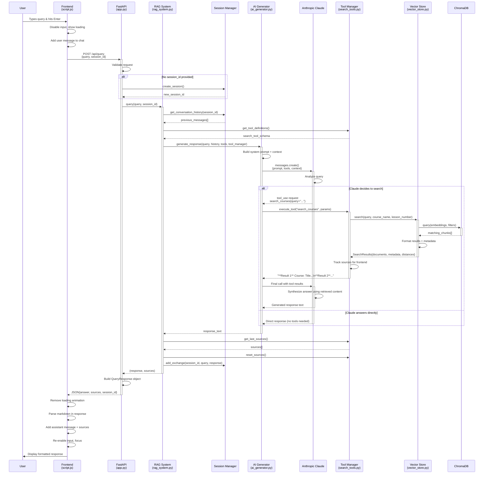
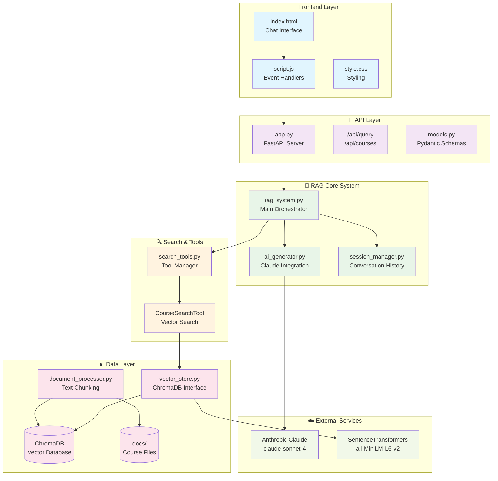

# RAG System Query Processing Flow

## Architecture Components

## Data Flow Summary

## Key Decision Points

1. **Session Creation**: New vs existing conversation
2. **Claude Tool Decision**: Search needed vs direct answer
3. **Vector Search**: Course filtering vs general search  
4. **Response Format**: Markdown rendering + source attribution
5. **Error Handling**: Graceful fallbacks at each layer