# RAG System Query Processing Flow

```mermaid
sequenceDiagram
    participant U as User
    participant FE as Frontend<br/>(script.js)
    participant API as FastAPI<br/>(app.py)
    participant RAG as RAG System<br/>(rag_system.py)
    participant SM as Session Manager
    participant AI as AI Generator + Router<br/>(ai_generator.py)
    participant Router as Provider Router
    participant OpenAI as OpenAI (AISuite)
    participant Gemini as Google Gemini (AISuite)
    participant Grok as xAI Grok (AISuite)
    participant Claude as Anthropic (SDK)
    participant TM as Tool Manager<br/>(search_tools.py)
    participant VS as Vector Store<br/>(vector_store.py)
    participant DB as ChromaDB

    %% User Input Phase
    U->>FE: Types query & hits Enter
    FE->>FE: Disable input, show loading
    FE->>FE: Add user message to chat

    %% API Call Phase
    FE->>+API: POST /api/query<br/>{query, session_id}
    API->>API: Validate request
    
    %% Session Management
    alt No session_id provided
        API->>SM: create_session()
        SM-->>API: new_session_id
    end

    %% RAG Processing
    API->>+RAG: query(query, session_id)
    RAG->>SM: get_conversation_history(session_id)
    SM-->>RAG: previous_messages[]
    
    RAG->>TM: get_tool_definitions()
    TM-->>RAG: search_tool_schema

    %% AI Generation Phase
    RAG->>+AI: generate_response(query, history, tools, tool_manager)
    AI->>AI: Build system prompt + context
    
    %% Provider Selection & Call
    AI->>Router: choose(OpenAI→Anthropic→Google→xAI)
    alt OpenAI available
        Router->>+OpenAI: chat.completions.create()<br/>{messages}
        OpenAI-->>AI: Direct response (no tools)
    else Anthropic available
        Router->>+Claude: messages.create()<br/>{prompt, tools, context}
        Claude->>Claude: Analyze query
    else Google available
        Router->>+Gemini: chat.completions.create()<br/>{messages}
        Gemini-->>AI: Direct response (no tools)
    else xAI available
        Router->>+Grok: chat.completions.create()<br/>{messages}
        Grok-->>AI: Direct response (no tools)
    end
    
    %% Tool Decision & Execution
    alt Anthropic decides to search
        Claude-->>AI: tool_use request<br/>search_courses(query="...")
        AI->>+TM: execute_tool("search_courses", params)
        TM->>+VS: search(query, course_name, lesson_number)
        VS->>+DB: query(embeddings, filters)
        DB-->>-VS: matching_chunks[]
        VS->>VS: Format results + metadata
        VS-->>-TM: SearchResults{documents, metadata, distances}
        TM->>TM: Track sources for frontend
        TM-->>-AI: "**Result 1** Course: Title...\n**Result 2**..."
        
        %% Final Response Generation (Anthropic)
        AI->>+Claude: Final call with tool results
        Claude->>Claude: Synthesize answer using retrieved content
        Claude-->>-AI: Generated response text
    else Model answers directly
        AI-->>AI: Direct response (no tools)
    end
    
    %% Response Assembly
    AI-->>-RAG: response_text
    RAG->>TM: get_last_sources()
    TM-->>RAG: sources[]
    RAG->>TM: reset_sources()
    RAG->>SM: add_exchange(session_id, query, response)
    RAG-->>-API: (response, sources)

    %% API Response
    API->>API: Build QueryResponse object
    API-->>-FE: JSON{answer, sources, session_id}

    %% Frontend Display
    FE->>FE: Remove loading animation
    FE->>FE: Parse markdown in response
    FE->>FE: Add assistant message + sources
    FE->>FE: Re-enable input, focus
    FE->>U: Display formatted response
```



## Architecture Components

```mermaid
graph TB
    %% Frontend Layer
    subgraph Frontend ["🎨 Frontend Layer"]
        HTML[index.html<br/>Chat Interface]
        JS[script.js<br/>Event Handlers]
        CSS[style.css<br/>Styling]
    end

    %% API Layer
    subgraph API ["🔌 API Layer"]
        FastAPI[app.py<br/>FastAPI Server]
        Routes["/api/query<br/>/api/courses"]
        Models[models.py<br/>Pydantic Schemas]
    end

    %% RAG Core
    subgraph RAG ["🧠 RAG Core System"]
        RAGSys[rag_system.py<br/>Main Orchestrator]
        AIGen[ai_generator.py<br/>Multi-LLM Integration + Router]
        SessionMgr[session_manager.py<br/>Conversation History]
    end

    %% Search & Tools
    subgraph Tools ["🔍 Search & Tools"]
        ToolMgr[search_tools.py<br/>Tool Manager]
        SearchTool[CourseSearchTool<br/>Vector Search]
    end

    %% Data Layer
    subgraph Data ["📊 Data Layer"]
        VectorStore[vector_store.py<br/>ChromaDB Interface]
        DocProcessor[document_processor.py<br/>Text Chunking]
        ChromaDB[(ChromaDB<br/>Vector Database)]
        Docs[(docs/<br/>Course Files)]
    end

    %% External Services
    subgraph External ["☁️ External Services"]
        OpenAIExt[OpenAI via AISuite]
        Claude[Anthropic (SDK)]
        GoogleExt[Google Gemini via AISuite]
        XAIExt[xAI Grok via AISuite]
        Embeddings[SentenceTransformers<br/>all-MiniLM-L6-v2]
    end

    %% Connections
    HTML --> JS
    JS --> FastAPI
    FastAPI --> RAGSys
    RAGSys --> AIGen
    RAGSys --> SessionMgr
    RAGSys --> ToolMgr
    AIGen --> OpenAIExt
    AIGen --> Claude
    AIGen --> GoogleExt
    AIGen --> XAIExt

    ToolMgr --> SearchTool
    SearchTool --> VectorStore
    VectorStore --> ChromaDB
    VectorStore --> Embeddings
    DocProcessor --> ChromaDB
    DocProcessor --> Docs

    %% Styling
    classDef frontend fill:#e1f5fe
    classDef api fill:#f3e5f5
    classDef rag fill:#e8f5e8
    classDef tools fill:#fff3e0
    classDef data fill:#fce4ec
    classDef external fill:#f1f8e9

    class HTML,JS,CSS frontend
    class FastAPI,Routes,Models api
    class RAGSys,AIGen,SessionMgr rag
    class ToolMgr,SearchTool tools
    class VectorStore,DocProcessor,ChromaDB,Docs data
    class OpenAIExt,Claude,GoogleExt,XAIExt,Embeddings external
```

## Data Flow Summary

```mermaid
flowchart LR
    A[👤 User Query] --> B[🎨 Frontend UI]
    B --> C[📡 HTTP POST]
    C --> D[🔌 FastAPI Endpoint]
    D --> E[🧠 RAG System]
    E --> F[🔀 Provider Router]
    F --> G{Provider}
    G -->|OpenAI (AISuite)| H1[🧠 OpenAI Response]
    G -->|Anthropic (SDK)| H2[🧠 Anthropic + Tools]
    G -->|Google (AISuite)| H3[🧠 Gemini Response]
    G -->|xAI (AISuite)| H4[🧠 Grok Response]
    H2 --> I[🔍 Vector Search]
    I --> J[📊 ChromaDB]
    J --> K[📋 Search Results]
    H1 --> L[✨ AI Response]
    H2 --> L
    H3 --> L
    H4 --> L
    L --> M[📤 JSON Response]
    M --> N[🎨 UI Update]
    N --> O[👁️ User Sees Answer]

    style A fill:#ffeb3b
    style O fill:#4caf50
    style F fill:#2196f3
    style I fill:#ff9800
    style J fill:#9c27b0
```

## Key Decision Points

1. **Session Creation**: New vs existing conversation
2. **Tool Decision (Anthropic only)**: Search needed vs direct answer
3. **Vector Search**: Course filtering vs general search  
4. **Response Format**: Markdown rendering + source attribution
5. **Error Handling**: Graceful fallbacks at each layer